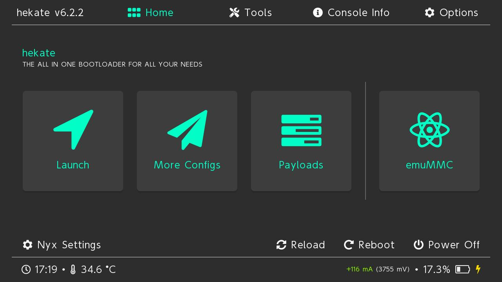
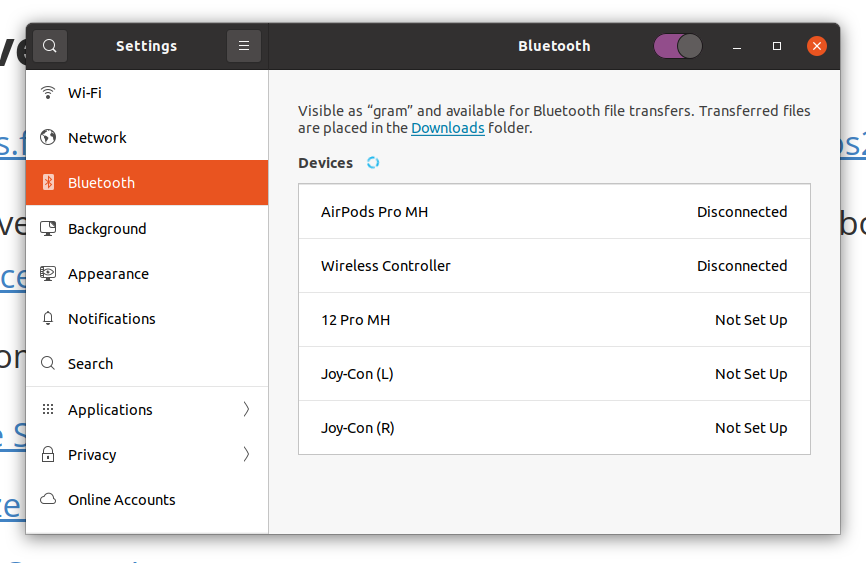

# Using a Nintendo Switch as ROS2 controller

## Inspiration and resources

* [Control your ROS robot from your phone!](https://www.youtube.com/watch?v=hkkG-Sgi9Sk) - is the Articulated Robotics video and [blog post](https://articulatedrobotics.xyz/tutorials/mobile-robot/applications/adv-teleop/) that inspired me originally. It introduces a basic browser-based tool for teleop and hints at the potential of Foxglove for building an even more capable robot controller. Later Josh wrote a dedicated Foxglove extension for joysticks that looks great for controlling robots in development, testing, production and to review recorded data - check the [video](https://www.youtube.com/watch?v=-JVHvU3Oor8), [discussion](https://discourse.articulatedrobotics.xyz/t/discussion-foxglove-joystick-panel/710) and [repo](https://github.com/joshnewans/foxglove-joystick). Not clear to me if one actually needs ROS installed on the console to go for this solution. Then there is also this [video](https://www.youtube.com/watch?v=JIGO3b-aoz8) and [discussion](https://discourse.articulatedrobotics.xyz/t/discussion-foxglove-webcam-panel/736) of a Foxglove webcam panel, and [this one](https://www.youtube.com/watch?v=Twsw2jZvzio) in which Josh describes the advantages of the Steamdeck .

* [Steam Deck as a Robot Controller](https://kamathsblog.com/steam-deck-as-a-robot-controller) is a blog post by A. Kamath, which discussses various ways to install ROS2 on the Steamdeck including ubuntu, robostack and distrobox, as well as other useful tools such as Foxglove, Plotjuggler, etc.
* [Robodeck](https://www.youtube.com/watch?v=KbF4r7yCCds&list=PL2dJBq8ig-vh42rfm8QEZFoCpYaBG7x2u) is a Youtube playlist by [Polyhobbyist / Lou Amadio](https://www.youtube.com/c/APolyhobbyist) about running ROS2 on Steamdeck using Robostack

At this point I could barely resist the urge to buy a Steamdeck. Then I came across this [twitter thread](https://x.com/almondgodd/status/1856891187665256939?s=46) about a cool project that used Nintendo Switch Joy-Cons to train a 2-arm robot, more details on the [blog post](https://rain-argon-1fc.notion.site/ALOHA-Bigym-Joycon-ACT-12063b18e1df80f99f84dc2fcc0721ac) and [repo](https://github.com/AlmondGod/Nintendo-Aloha). Shortly after that, I learnt about [@r_frojd](https://x.com/r_frojd/status/1357020027694833677) running ROS on a Nintendo Switch. 

This was clearly the Universe speaking to me, because I happen to own a Nintendo Switch, so I realized I was destined to enter history as the pioneer who found the way to use the Nintendo Switch in lieu of the Steamdeck as a robot controller - or at least the first who published it.

A Google search informed me that installing Linux on the console involves hacking it first, and not all consoles are hackable. As a matter of fact, the one I owned was not suitable. 

No surprise most of the hacking tutorials I found online (e.g. [this one]([How to Mod Your Nintendo Switch! FULL GUIDE (Latest firmware not supported)](https://www.youtube.com/watch?v=lrgjXqPEOJk) )) were directed at gamers, focused on working from a Windows PC, and involved backing up existing data to allow dual boot with the original firmware. 

This guide focuses instead on installing Linux on a fresh SD card, without dual boot or mixing with the original OS or homebrew alternatives, and it assumes working from a Linux PC.

## Bill of Materials

- I rushed to buy an old unpatched Nintendo Switch console from [ebay](https://www.ebay.es/sch/i.html?_nkw=unpatched+nintendo+switch&_sacat=0&_from=R40&_trksid=p4432023.m570.l1313) for ~$125. Not such a bargain considering I had to pay additional ~70€ in taxes(!) when a few weeks later it arrived from Japan without Joy-Cons, dock, or charger. A set of new Joy-cons I ordered from [Amazon](https://www.amazon.es/dp/B01N5OORGV) added 67.90€ to the bill. That's ~270€ altogether, so maybe hunting for old S/N in the local [CeX](https://es.webuy.com/) would have been a better idea - probably faster and cheaper.
- A fast UHD-I microSD card: [the switchroot guide recommends](https://wiki.switchroot.org/wiki/sd-card-guide) the 128Gb U3 class Samsung Pro Plus, 28.58€ from [Amazon](https://www.amazon.es/dp/B0BYPDJ9ZW)
- An RCM jig, 6.29€ from [Amazon](https://www.amazon.es/dp/B0CYL1TFYJ)


## Check that your console can be hacked

Newer consoles have been patched against the vulnerability exploited by this method, so you'll need to: 

1. Find out the Serial Number of your console ([Where?](https://en-americas-support.nintendo.com/app/answers/detail/a_id/58879/~/where-can-i-find-my-system-serial-number%3F) TLDR; read the physical sticker on the side of the console, or go to **HOME** Menu > **System Settings** > Scroll down the left-hand menu on the side and select **System** > **Serial Information** > **Console Serial Number**)

2. Check if you're in luck using one of the online SN checkers, e.g. [SSNC](https://damota.me/ssnc/checker/) or [ismyswitchpatched.com](https://ismyswitchpatched.com)

| [](https://damota.me/ssnc/checker/) | [](https://ismyswitchpatched.com) |
| --------------------------------------------------------- | ------------------------------------------------------------ |

## Prepare the SD card

Format the SD card to FAT32. The fastest method in Linux is [using the terminal](https://recoverit.wondershare.com/file-system/linux-format-usb-fat32.html#part3). 

Download Hekate 6.0.6 or newer: I downloaded `hekate_ctcaer_6.2.2_Nyx_1.6.4.zip` from [here](https://github.com/ctcaer/hekate/releases)

Unzip and drag all contents onto the SD

## Prepare the Hekate payload

We need a [payload launcher for Linux](https://www.youtube.com/watch?v=Y8kGno8F6v4). 

Install dependencies and clone the [fusee-launcher](https://github.com/Yankas/fusee-launcher?tab=readme-ov-file) repo. 

```bash
$ sudo apt update && sudo apt upgrade
$ sudo apt install python3 python3-pip python3-usb git 
$ python3 -m pip install --upgrade pip
$ git clone git clone https://github.com/Yankas/fusee-launcher.git
```

Copy the file `hekate_ctcaer_6.2.2.bin` from the zip to the `fusee-launcher` folder 

## Booting the console into RCM Mode

Source: [YouTube tutorial](https://www.youtube.com/watch?v=d042IoBkJjI)

1. Remove the right Joycon and slide the RCM clip fully into the rail 

2. Power off the console fully **Power** button long press > **Power Options** > **Turn off**
3. Plug the console to one of the blue USB 3.0 ports of the computer 

3. While holding **Volume Up** button press **Power** button once. Screen should remain black. We're in!

## Inject the Hekate payload

```bash
$ cd fusee-launcher
$ sudo python3 fusee-launcher.py hekate_ctcaer_6.2.2.bin
Important note: on desktop Linux systems, we currently require an XHCI host controller.
A good way to ensure you're likely using an XHCI backend is to plug your
device into a blue 'USB 3' port.

Identified a Linux system; setting up the appropriate backend.
Found a Tegra with Device ID: b'@\x03\x00\x18\x00\x00\x00\x08\x87x-d\x01\x10\x10b'

Setting ourselves up to smash the stack...
Uploading payload...
Smashing the stack...
The USB device stopped responding-- sure smells like we've smashed its stack. :)
Launch complete!
```

Power up the console. The first time we need to set the time, then we are in Hekate Home. You may unplug the console and remove the RCM clip.



Now we can follow the [switchroot tutorial](https://wiki.switchroot.org/wiki/linux/l4t-ubuntu-jammy-installation-guide) to install Ubuntu 22.04. This [video](https://m.youtube.com/watch?v=pA5JarWyIXw) is a good help. `theofficialgman-ubuntu-jammy-5.1.2-2024-10-18.7z`

Make a partition of the SD card

**Tools** > **Partition SD Card** 


 


 


  


**Nyx Settings** > **Dump Joy-Con BT** 

When dumping  the Joy-con BT I got a message that it failed to get IMU calibration, see screenshot. Joy-Cons are brand new, I checked in the original firmware they work fine and even recalibrated along these instructions: https://www.youtube.com/watch?v=BAMB-kfmqYw 


Ta-da!


## Configure Foxglove

Sign in at https://foxglove.dev 

Open connection > rosbridge

Chromium Menu > Cast, save and share > Create shortcut...

rename and click Open as window

Right click on the icon > Allow launching

### Foxglove resources

https://docs.foxglove.dev/docs/connecting-to-data/frameworks/ros2

Foxglove gives your team observability-driven features to bring robotics to market faster: [record device data](https://hs.foxglove.dev/e3t/Ctc/GG+113/d2yMq604/VWCknG5lXxNrW7wSskK1H7hTtW3hB9jJ5rh7T2N5j5FQR3qgyTW7Y8-PT6lZ3lBN8zMNddLlrVtW85-3g44S2XVTVv9z0L2cvdWyW7GvT0T3Y32zQW4dfYV71Q0Z35W3QR5B5756cGMW4v27DJ5SZf5lW60WJRJ4BggdjW3Hrdcc5k0NJfW265lTK5VTZPRW83hh_Y8Tm6XsW5trPHn6mf4SmW93J3J-6sSCrqW3Kl5j53qV_6xW224rPX42fT6YN8qnHyn41zvZW4r8pqj5FbWcqW1996fr57_KqdW32YKBp7p1vhTW21hsm34NRRLyN1z862Sdn6ybN4ZbyKfx2J0_Vg82-b8jqDwVN2SjT51mDHTxVq0gxL3DHBqJW4XYryB7G6QPKf8pxTVT04), [tag notable events](https://hs.foxglove.dev/e3t/Ctc/GG+113/d2yMq604/VWCknG5lXxNrW7wSskK1H7hTtW3hB9jJ5rh7T2N5j5FQx3qgyTW7lCdLW6lZ3nYW31KBN647FNtRW6vwhVw3tK3lwW2wdp4S67flVNW1wryz94jNWFvW4Z29hM8KXL8NW4v8NyX4bCdPgW2429Vm4z6HqXW2gp7ms30QG84W3c6-Sv6nVFGlW1mGm6H4Mx0RGW3G58_B26LndSW2sFJJX5tXZ-tW4ygPBs7nvDbqW8s9-S21QLkl2W2wmfjx7TD0gJW1xJfKQ9cG_m2W2BlKFj16svSYW29GPTB4QVMtNW8Y1_Gr8C01tfN27r5nlfYz64W3zT08j5--kzVW6VRm9k8gztmwW6yphSX4F7hDNW7MLCF61Gm4-Nf83YQRd04), [collaborate](https://hs.foxglove.dev/e3t/Ctc/GG+113/d2yMq604/VWCknG5lXxNrW7wSskK1H7hTtW3hB9jJ5rh7T2N5j5FR63qgyTW8wLKSR6lZ3mNW51wHdK5TWnznN2hyFjcChjC0W7y2pp84V11mJW2dX-_b3S2Np6W6CW9kH6H10mKW2M2P-X40BFG9W3kwQCK4_bMD6W41wF359dH4R7W5yNzmH7vMsffW3J2dYn85dT-2VNPNH67vsMwpW56Vv2Q5XX1gtW8_vff-8WtnzLW26_nks83QDXjVtyHQ35VpltxW2Ptms3449yByW18Fn0W8HNt2CW7QDzNn64g_MKW83cgFM76hShJW7SHPBm5PqB6ZW7_BZ9B6yyTd4W3vd1mg7K_cQ5W4CGRy37p8vdVN3h7gWz5shJ2W2281M4860xcHW30TNpG6s-XnHW7R-NyV1qc_ZDW5QM3Tg8CqNYgf2V1D1z04), and more.

 Here are some useful resources to get started:

- [Explore Sample Data in Foxglove](https://hs.foxglove.dev/e3t/Ctc/GG+113/d2yMq604/VWCknG5lXxNrW7wSskK1H7hTtW3hB9jJ5rh7T2N5j5FQx3qgyTW7lCdLW6lZ3pqW8rsDMl1XyGRpN6r-dkKqzgstW2qYP1Z5V35RkW71lwvK76L-FQW999dcP4JxGqSW1RB9TJ56FYWqVgFQ2L8XVhg2F99HpBX8VtxW41FQpt2_997VW5ZjYvN3CPxbpW5dzxSC362-bbV2SgNl7Qb9bdW3dBFtH69Y9n0W859t3z96xqK6W4SSy4L1dbQ4fW2fFNWF6kRzf1W5lz2cC99CFGQW6rySBB8l_gTPW1vSBtH1q2rN3W14rn5x26v9bBW5zLMt49h_FF8W61fRxn1swRqWW3YN19c4bX-_JN5XkL5RSm20_f7kM73Y04)
- [Visualize a locally stored data file](https://hs.foxglove.dev/e3t/Ctc/GG+113/d2yMq604/VWCknG5lXxNrW7wSskK1H7hTtW3hB9jJ5rh7T2N5j5FR63qgyTW8wLKSR6lZ3pgVpFVm869xt-FVdbQ6z66xs8kVT6ZMp5yp1v-MtVsNlMWxl3W4wZkBX7dz1clW87xCq-6SWmwTW4CZNbq22Zwy4W6nyGsN6wSKTjW44LPW133wQTYW1hsDMJ3Tf2HYVWXymJ66MMWTW71vcN81TNFzzW9cjkGq9gM6THW7yYXc92RNzVWW43Lzyn4Kn5N4V60dfh4NX3wXW4gnb718CqLFzW8074VB65vMHxW8M-mD65B5tgYW56Nmz94SpkvkW1rkw4K44VZ6TW6lm20R364lB4W5DzHnR8qfdjwVJHtCq51L5NdVS9Wl94NFf8HN341w62z1TbFW2b3FyD18BzQjW6fw9Dc5GkkfCdq7Kmz04)
- [Build a Custom Layout](https://hs.foxglove.dev/e3t/Ctc/GG+113/d2yMq604/VWCknG5lXxNrW7wSskK1H7hTtW3hB9jJ5rh7T2N5j5FQR3qgyTW7Y8-PT6lZ3llW7lK-c27_t9jvW1WQYlx3mHGDwW2gpLSQ6Jn4_3W2mPKVV4B_RZqW8DzlTw3MRzTGW20z6x16F7kTLW7FZs6X4rTscTW84TSqH4KZhN-W4Rbk0d8Fkf0VW6v4xCR4jkBlDW2dtY4c8XmKTFVPvSnw73jvZBM6TFQ534VGnW8ps2qN3xBMxRW5mVhHP1R9pcZW76zLKw6BLkgHW4QN9lx50pzH3W8C2DmX2X5vl1N8PTJJbLYZB7W1yJhZb2bpQ67VYf1BP4gY-jtVwkB3g1zLYsmW2ksJm16ydv_CW84TnVR8FKx2kW38kSpz3LXYqRW3LcQ2q77qdlYf8nJST004)

email [adrian@foxglove.dev](adrian@foxglove.dev) , [join our Slack community](https://hs.foxglove.dev/e3t/Ctc/GG+113/d2yMq604/VWCknG5lXxNrW7wSskK1H7hTtW3hB9jJ5rh7T2N5j5FRq3qgyTW95jsWP6lZ3p8W7Z4qyF9612lZW1pbq3S3V8h2gW4BpPPz7c28xNW5RyFRY7C-YdvW4-Rs_S32rWJ-W7-pyMS7fmykyW6g1Kt-913vKYN12NCXyqPVf1W5Wmw8S3lys61W6yWLv97jNX9FW61nTb-7nNGJ7W6nRl4d6TB93VW42q3Y06cv_HzN3YCsW3msCkVW7GqVl64RNH7fW8-w5Dq6P6vGlW63wynk98XwxnW2nBVyD18xYW0V9Lj221r96VXW21cDj37bMDb0W91vHJY6B5LBnW1HmWNj45Xb_1W6B0Lw78_GrgPVCbGG84BgB9kW3x-pnG6M96byW7cn1tt6MM2PVW8Tyw_Y8cb9mrW6VpcyD14tXrJW4krJ7j2g5r3_W1JQG_F6gLqyHf88jRTx04), or [explore our developer docs](https://hs.foxglove.dev/e3t/Ctc/GG+113/d2yMq604/VWCknG5lXxNrW7wSskK1H7hTtW3hB9jJ5rh7T2N5j5FQR3qgyTW7Y8-PT6lZ3n9W3JDNwN7CrFmXW5yjHCk5kDx4MW3c0NpQ42HKK8W5rDnjc5WvpbWW4Z-yQQ6TbRk6W8N_s4H2zGVzcW21xCRJ5K07ZxW1TVpFd6mFntvVmzstw3Qncs9W30t-9t2wjVm-W1x49z-4PsmLXW4y4Wxk67rPVnV_KPdd4PY1NYW1pZrm12PpNPLW8JQ45J1PZkK9W2NBr2H8fPfqsW2BwDl71tJH0cN3Vmv9T6lN1tV7xMKB6B5cyDW3fQdZk8jM40pW5LS4L42Hy2GDW4y8Gmb6yPlXYW2bfg3S5QGQpwW2W4DNj1xKq8hW5hmkMs4cRPvmW1Gj_zF43zKwTf3HnTkY04).

## Joy-Cons in Linux





## A quick'n'dirty GUI to display Joy-Con orientation

I mocked up a quick'n'dirty GUI to display the orientation of the Joy-Cons. As a first step [joy_con_gui.py](./src/joy_con_gui.py) draws two blocks resembling the Joy-Cons and allows to rotate them with the keyboard.


#### **Keyboard Controls:**

##### **Left Joy-Con (Neon Red)**

- **W** → Rotate **Down** (tilt backward, decreasing X-axis angle)
- **S** → Rotate **Up** (tilt forward, increasing X-axis angle)
- **A** → Rotate **Left** (tilt counterclockwise around Y-axis)
- **D** → Rotate **Right** (tilt clockwise around Y-axis)

##### **Right Joy-Con (Neon Blue)**

- **I** → Rotate **Down** (tilt backward, decreasing X-axis angle)
- **K** → Rotate **Up** (tilt forward, increasing X-axis angle)
- **J** → Rotate **Left** (tilt counterclockwise around Y-axis)
- **L** → Rotate **Right** (tilt clockwise around Y-axis)

Note: the Yaw rotation axis is missing !

## Getting orientation out of the Joy-Cons

Next I want to get the orientation from the motion control data streamed by the Joy-Cons. Like this:


Inspiration came from this project https://github.com/AlmondGod/Nintendo-Aloha (see the [twitter thread](https://x.com/Almondgodd/status/1856891189653340656) and [blog post](https://rain-argon-1fc.notion.site/ALOHA-Bigym-Joycon-ACT-12063b18e1df80f99f84dc2fcc0721ac)) which used this promising python library: https://github.com/tocoteron/joycon-python (there may be some recent forks with added functionality)

```bash
$ pip install joycon-python hidapi pyglm
```

Unfortunately I could not make it work: Joy-Cons are connected and send data via `evtest` or `evdev` (only buttons though, not motion control) but still `hid.enumerate()`finds only mouse and keyboard but not the Joy-Cons, therefore `joycon-python` does not work. 

I did extensive troubleshooting and tried many things:

- tried installing `cython-hidapi` from here: https://github.com/trezor/cython-hidapi and `hid`
- added udev rules to permanently give permissions `$ sudo nano /etc/udev/rules.d/50-nintendo-switch.rules`: 

```bash
# Switch Joy-con (L) (Bluetooth only)
KERNEL=="hidraw*", SUBSYSTEM=="hidraw", KERNELS=="0005:057E:2006.*", MODE="0666"

# Switch Joy-con (R) (Bluetooth only)
KERNEL=="hidraw*", SUBSYSTEM=="hidraw", KERNELS=="0005:057E:2007.*", MODE="0666"

# Switch Pro controller (USB and Bluetooth)
KERNEL=="hidraw*", SUBSYSTEM=="hidraw", ATTRS{idVendor}=="057e", ATTRS{idProduct}=="2009", MODE="0666"
KERNEL=="hidraw*", SUBSYSTEM=="hidraw", KERNELS=="0005:057E:2009.*", MODE="0666"

# Switch Joy-con charging grip (USB only)
KERNEL=="hidraw*", SUBSYSTEM=="hidraw", ATTRS{idVendor}=="057e", ATTRS{idProduct}=="200e", MODE="0666"
```

After editing the file it is necessary to reload the rules with: `$ udevadm control --reload-rules`

Somehow I came to the conclusion that this is the problem:

```bash
$ sudo modprobe hid_nintendo
modprobe: FATAL: Module hid_nintendo not found in directory /lib/modules/5.15.0-131-generic
```

I am on ubuntu 20.04 and my kernel version 5.15.0-131 does not include the `hid-nintendo` driver (it was added in kernel 5.16 which corresponds to ubuntu 21.10) 

Tried upgrading the kernel with the following steps and broke ubuntu (no wifi) so I went back.

1. Add the latest mainline kernel repository:

   ```bash
   $ sudo add-apt-repository ppa:cappelikan/ppa
   $ sudo apt update
   ```

2. Install the latest kernel (e.g., 6.5 or 6.6):

   ```bash
   $ sudo apt install mainline
   $ mainline --install-latest
   ```

3. Reboot:

   ```bash
   $ sudo reboot
   ```

4. Verify the upgrade:

   ```bash
   $ uname -r
   ```

After upgrading, try:

```bash
$ sudo modprobe hid_nintendo
```

If successful, `dmesg | grep -i nintendo` should show logs.

Anyway, I had to revert. Instead I tried to install it manually:

Download the `hid-nintendo` Source Code:

```bash
$ cd /usr/src
$ sudo git clone https://github.com/nicman23/dkms-hid-nintendo.git
$ cd dkms-hid-nintendo

$ sudo dkms add .
$ sudo dkms build nintendo -v 3.2
$ sudo dkms install nintendo -v 3.2
```

After this it seemed to work...

```bash
$ sudo modprobe hid_nintendo
$ lsmod | grep hid_nintendo
hid_nintendo           49152  0
ff_memless             24576  1 hid_nintendo
hid                   147456  6 hid_nintendo,i2c_hid,hidp,usbhid,hid_multitouch,hid_generic
$ dmesg | grep -i nintendo
[...]
[ 3340.136843] nintendo 0005:057E:2007.0005: delta=136 avg_delta=15
[ 3344.471943] nintendo 0005:057E:2007.0005: compensating for 7 dropped IMU reports
[ 3344.471951] nintendo 0005:057E:2007.0005: delta=136 avg_delta=15
[ 3348.041780] nintendo 0005:057E:2007.0005: compensating for 7 dropped IMU reports
[ 3348.041791] nintendo 0005:057E:2007.0005: delta=136 avg_delta=15
[...]
```

But still `hid.enumerate()` did not detect the joycons. 

I'll try on a more modern kernel...

## Other options to explore

* [JoyconLib](https://github.com/Looking-Glass/JoyconLib/blob/master/README.md) is a library for Unity featuring button/stick polling, HD rumble, and accelerometer data processing. By Evan Kahn / @wormyrocks. Discussion: https://gbatemp.net/threads/joy-con-unity-library.486629/
* [JoyCon-Driver](https://github.com/fossephate/JoyCon-Driver) is a Windows Driver for the Nintendo Switch JoyCons and Pro Controller with support for analog stick and motion controls
* [Nintendo Switch Reverse Engineering](https://github.com/dekuNukem/Nintendo_Switch_Reverse_Engineering) all you ever wanted to know about the Nintendo. See this issue: [Gyroscope / Accelerometer Status #18](https://github.com/dekuNukem/Nintendo_Switch_Reverse_Engineering/issues/18)
* A [Joy Con Web HID](https://tomayac.github.io/joy-con-webhid/) - Web HID driver for [Nintendo Joy-Cons](https://en.wikipedia.org/wiki/Joy-Con) with support for all buttons, analog sticks, and the device’s gyroscope and accelerometer sensors.
* [Using Nintendo Joy-Cons to Control Rock ‘Em Sock ‘Em Robots](https://www.hackster.io/news/using-nintendo-joy-cons-to-control-rock-em-sock-em-robots-40396d338d74)
* [Using Nintendo Switch controllers on Linux](https://joaorb64.github.io/2020/04/08/using-nintendo-switch-controllers-on-linux.html) discussion claims installing [dkms-hid_nintendo](https://github.com/nicman23/dkms-hid-nintendo) as a module and the [joycond](https://github.com/DanielOgorchock/joycond) daemon should do the trick, but someone in the comments complains this doesn't work in 20.04...
* [joycon](https://github.com/riking/joycon) is a Joy-Con input driver for Linux, but motion control is still in their To Do list

## The one that worked

This is a [great summary review of the different options](https://www.reddit.com/r/linux_gaming/comments/fxwh54/using_nintendo_switch_controllers_on_linux/) available by 2020... Claims `hid-nintendo` is present since kernel 5.10, see also [this](https://www.phoronix.com/forums/forum/software/linux-gaming/1204007-nintendo-switch-controller-driver-to-be-upstreamed-with-linux-5-10)

1. install `dkms_hid_nintendo` if the kernel does not include `hid_nintendo`

```bash
$ git clone https://github.com/nicman23/dkms-hid-nintendo
$ cd dkms-hid-nintendo
$ sudo dkms add .
$ sudo dkms build nintendo -v 3.2
$ sudo dkms install nintendo -v 3.2
```

2. install `joycond` driver:

```bash
$ git clone https://github.com/DanielOgorchock/joycond
$ sudo apt-get install libevdev-dev
$ cd joycond
$ cmake .
$ sudo make install
$ sudo systemctl enable --now joycond
```

3. install the cemu hook

```bash
$ pip3 install git+https://github.com/joaorb64/joycond-cemuhook
```

4. Run the hook. 
5. Connect the Joy-Cons to the PC. First wake them up pressing the black centre button on the side until the LED starts scanning. Otherwise the **Connect** slide switch in the Bluetooth Settings window will not respond. 
6. Pair them: pressing SL+SR buttons to pair each Joy-Con individually or ZL+ZR to pair them combined

```bash
$ joycond-cemuhook 
Looking for Nintendo Switch controllers...
================= ('127.0.0.1', 26760) ================
Device         LED status   Battery Lv   MAC Addr    
1 🕹️ L          ■ □ □ □      55.0 ▄       AC:FA:E4:A4:A2:5B
2 🕹️ R          ■ ■ □ □      70.0 ▅       AC:FA:E4:A4:36:BC
3 ❎ 
4 ❎ 
=======================================================


================= ('127.0.0.1', 26760) ================
Device         LED status   Battery Lv   MAC Addr    
1 🎮 L+R       ■ ■ ■ □      55.0 ▄       AC:FA:E4:A4:36:BC
2 🎮 L+R       ■ ■ ■ □      55.0 ▄       AC:FA:E4:A4:A2:5B
3 ❎ 
4 ❎ 
=======================================================

```

But.. how is motion control data exposed? Turns out.. new dedicated devices have appeared:

```bash
$ evtest
No device specified, trying to scan all of /dev/input/event*
Not running as root, no devices may be available.
Available devices:
/dev/input/event20:	Nintendo Switch Left Joy-Con IMU
/dev/input/event22:	Nintendo Switch Right Joy-Con IMU
/dev/input/event23:	Nintendo Switch Combined Joy-Cons
Select the device event number [0-23]: 20
Input driver version is 1.0.1
Input device ID: bus 0x5 vendor 0x57e product 0x2006 version 0x8001
Input device name: "Nintendo Switch Left Joy-Con IMU"
Supported events:
  Event type 0 (EV_SYN)
  Event type 3 (EV_ABS)
    Event code 0 (ABS_X)
      Value    287
      Min   -32767
      Max    32767
      Fuzz      10
      Resolution    4096
    Event code 1 (ABS_Y)
      Value    -18
      Min   -32767
      Max    32767
      Fuzz      10
      Resolution    4096
    Event code 2 (ABS_Z)
      Value   4216
      Min   -32767
      Max    32767
      Fuzz      10
      Resolution    4096
    Event code 3 (ABS_RX)
      Value      0
      Min   -32767000
      Max   32767000
      Fuzz      10
      Resolution   14247
    Event code 4 (ABS_RY)
      Value   1000
      Min   -32767000
      Max   32767000
      Fuzz      10
      Resolution   14247
    Event code 5 (ABS_RZ)
      Value    999
      Min   -32767000
      Max   32767000
      Fuzz      10
      Resolution   14247
  Event type 4 (EV_MSC)
    Event code 5 (MSC_TIMESTAMP)
Properties:
  Property type 6 (INPUT_PROP_ACCELEROMETER)
Testing ... (interrupt to exit)
Event: time 1738461230.860033, type 4 (EV_MSC), code 5 (MSC_TIMESTAMP), value -711924796
Event: time 1738461230.860033, type 3 (EV_ABS), code 3 (ABS_RX), value -1999
Event: time 1738461230.860033, type 3 (EV_ABS), code 4 (ABS_RY), value 3000
Event: time 1738461230.860033, type 3 (EV_ABS), code 5 (ABS_RZ), value -1999
Event: time 1738461230.860033, type 3 (EV_ABS), code 0 (ABS_X), value 289
Event: time 1738461230.860033, type 3 (EV_ABS), code 2 (ABS_Z), value 4218
Event: time 1738461230.860033, -------------- SYN_REPORT ------------
Event: time 1738461230.860035, type 4 (EV_MSC), code 5 (MSC_TIMESTAMP), value -711919796
Event: time 1738461230.860035, type 3 (EV_ABS), code 3 (ABS_RX), value -4998
Event: time 1738461230.860035, type 3 (EV_ABS), code 4 (ABS_RY), value 1000
Event: time 1738461230.860035, type 3 (EV_ABS), code 5 (ABS_RZ), value -999
Event: time 1738461230.860035, type 3 (EV_ABS), code 0 (ABS_X), value 290
Event: time 1738461230.860035, type 3 (EV_ABS), code 2 (ABS_Z), value 4220
Event: time 1738461230.860035, -------------- SYN_REPORT ------------
Event: time 1738461230.860036, type 4 (EV_MSC), code 5 (MSC_TIMESTAMP), value -711914796
Event: time 1738461230.860036, type 3 (EV_ABS), code 3 (ABS_RX), value -5997
Event: time 1738461230.860036, type 3 (EV_ABS), code 4 (ABS_RY), value 3000
Event: time 1738461230.860036, -------------- SYN_REPORT ------------
Event: time 1738461230.875011, type 4 (EV_MSC), code 5 (MSC_TIMESTAMP), value -711894796
Event: time 1738461230.875011, type 3 (EV_ABS), code 3 (ABS_RX), value 5997
Event: time 1738461230.875011, type 3 (EV_ABS), code 4 (ABS_RY), value 2000
Event: time 1738461230.875011, type 3 (EV_ABS), code 5 (ABS_RZ), value -1999
Event: time 1738461230.875011, type 3 (EV_ABS), code 2 (ABS_Z), value 4221
[...]
```

Net step is writing a python script that connects to the device using  `evdev` and monitors the stream of events to updates an `orientation` state variable. Note the sign conventions.

|  |  |
| ---------------------------------- | ----------------------------------- |

`one_joy_con.py`- first attempt at displaying roll pitch yaw for a JoyCon.

`two_joy_cons.py` - improved and encapsulated in a class to display RPY for both JoyCons. Kalman filter is implemented but deactivated because I could not get it to work. Roll is ok, Pitch is clipped +/-90 degrees, Yaw is still a drama...

Next step is to link this with the GUI.


